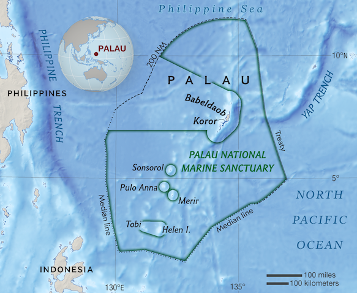

# National Geographic Society's Pristine Seas Expedition: Palau - 2024

This repository holds the data analyses related to this scientific expedition which took place on-board the RV ARGO between February and March, 2024. 

